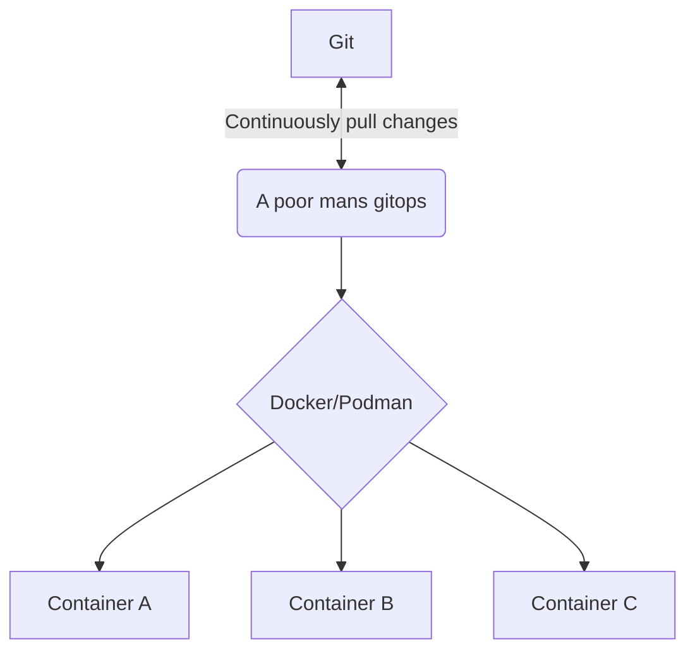

# Poor man's gitops

The idea of this project is to provide a true gitops experience for small, most likely single node setups. Therefore it's main target environment is a single node docker setup without k8s or similar orchestration solutions.

## Project idea

A small and lightweight service (maybe even in docker itself) which monitors a git repository and applies found manifests (e.g. docker-compose files) to the local docker/podman.

## Minimal viable feature set

* Continuously monitors one given git repository
* Applies found docker-compose files to the local docker/podman instance
* Can be run in docker itself
* Minimal web ui to see what is deployed and what not

## Possible feature set

* Support deployments without zero downtime
* Prometheus metrics
* Run as a systemd service
* Webhooks to notify about health changes and deployment updates
* Support for other kind of manifest files than docker-compose
* Support for multiple git repositories
* Auto generate secrets for zero trust
* much more

